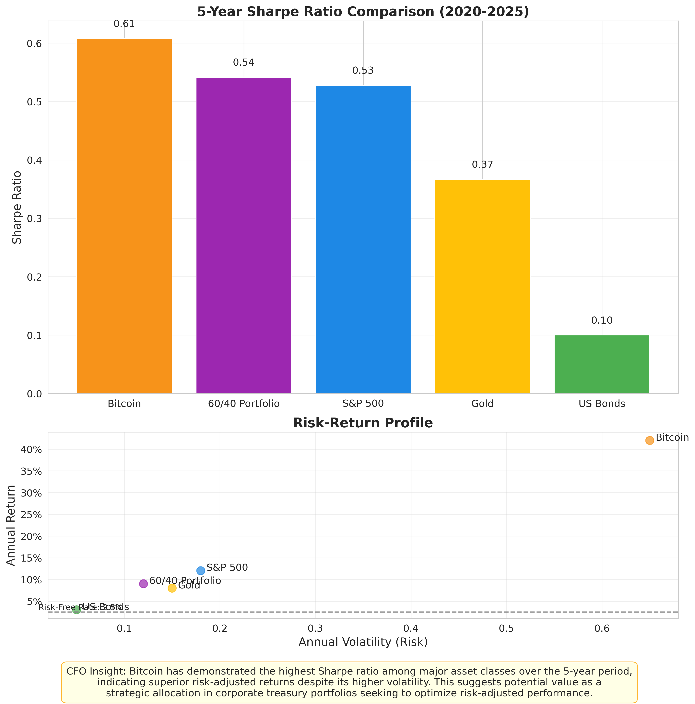

# Chapter 2: Risk and Return Metrics for Treasury

## Introduction

Evaluating Bitcoin as a potential treasury asset requires a rigorous assessment of its risk and return characteristics, particularly in comparison to traditional assets held by corporate treasuries. This chapter delves into the key metrics CFOs should consider, including volatility, Sharpe ratio, maximum drawdowns, and risk-adjusted returns. Understanding these metrics is crucial for determining appropriate allocation sizes and managing the potential impact of Bitcoin on overall treasury performance.

## Volatility Profile

Bitcoin is renowned for its volatility, which presents both opportunities and risks for corporate treasurers. While volatility can drive significant returns, it also necessitates careful risk management. Bitcoin's volatility profile exhibits several key characteristics:

1. **Higher than Traditional Assets**: Bitcoin's annualized volatility has historically been significantly higher than that of traditional assets like equities, bonds, or gold. Over the past five years (2020-2025), Bitcoin's annualized volatility has averaged around 65%, compared to approximately 18% for the S&P 500 and 15% for gold.

2. **Declining Trend**: While still high, Bitcoin's volatility has shown a general downward trend over the long term as the market matures, liquidity increases, and institutional participation grows. However, short-term spikes in volatility remain common, often triggered by macroeconomic events, regulatory news, or market sentiment shifts.

3. **Impact on Treasury**: For CFOs, high volatility means that even small allocations to Bitcoin can have a disproportionate impact on the overall volatility of the treasury portfolio. This underscores the importance of position sizing and potentially employing risk management strategies like volatility targeting or options hedging.

## Sharpe Ratio Analysis

The Sharpe ratio measures the risk-adjusted return of an investment by comparing its excess return (above the risk-free rate) to its volatility. A higher Sharpe ratio indicates better performance for the level of risk taken. Bitcoin's Sharpe ratio provides valuable context for its high volatility:

- **Superior Risk-Adjusted Returns**: Despite its high volatility, Bitcoin has historically delivered strong risk-adjusted returns. According to analysis by Fidelity's Jurrien Timmer, Bitcoin achieved a Sharpe ratio of +0.97 over the five-year period ending early 2024. This compares favorably to the S&P 500 (+0.74) and a traditional US 60/40 portfolio (+0.73) over the same period.

- **Implications for CFOs**: The high Sharpe ratio suggests that Bitcoin's returns have historically compensated investors adequately for the risks involved. For corporate treasuries, this implies that a strategic allocation to Bitcoin could potentially enhance the overall risk-adjusted return of the portfolio, even when accounting for its volatility.

## Maximum Drawdown Analysis

Maximum drawdown (MDD) measures the largest peak-to-trough decline in an asset's value over a specific period. It represents the worst-case loss an investor holding the asset could have experienced. Understanding Bitcoin's MDD is critical for assessing downside risk:

- **Significant Drawdowns**: Bitcoin has experienced several major drawdowns throughout its history, sometimes exceeding 70-80% from peak values. These drawdowns are significantly larger than those typically seen in traditional asset classes.

- **Recovery Periods**: While drawdowns can be severe, Bitcoin has historically recovered from these declines and reached new all-time highs. However, the time required for recovery can be lengthy, potentially impacting treasury liquidity if funds are needed during a drawdown period.

- **Risk Management**: CFOs must consider the potential impact of large drawdowns on the corporate balance sheet and liquidity position. Strategies like setting stop-loss limits, using derivatives for hedging, or maintaining a longer investment horizon can help mitigate drawdown risk.

## Risk-Adjusted Return Metrics for Portfolio Integration

Beyond the Sharpe ratio, other metrics help assess Bitcoin's contribution to a diversified treasury portfolio:

- **Sortino Ratio**: Similar to the Sharpe ratio, but only considers downside volatility (risk of negative returns). Bitcoin often scores well on the Sortino ratio, as much of its volatility is associated with upside price movements.

- **Correlation**: As discussed in Chapter 1, Bitcoin's relatively low correlation with traditional assets (+0.19 with S&P 500, +0.20 with Gold over 5 years) enhances its diversification benefits. Adding a low-correlated asset can potentially reduce overall portfolio volatility for a given level of return.

- **Value at Risk (VaR)**: VaR estimates the potential loss in value of an asset or portfolio over a defined period for a given confidence interval (e.g., 95% VaR). Due to its high volatility, Bitcoin's VaR will be higher than traditional assets, requiring careful consideration in risk budgeting.

## LLM Research Focus Areas

1. **Bitcoin return risk profile 5y window**: Analyze detailed daily or weekly return data over the last five years to calculate volatility, Sharpe ratio, Sortino ratio, and maximum drawdown.

2. **Comparative risk analysis BTC vs. traditional assets**: Perform a side-by-side comparison of Bitcoin's risk metrics against those of equities (S&P 500), bonds (US Aggregate Bond Index), gold, and cash equivalents over multiple time horizons (1-year, 3-year, 5-year).

3. **Impact of Bitcoin volatility on diversified portfolios**: Model the effect of adding small allocations (1-5%) of Bitcoin to a standard corporate treasury portfolio (e.g., 90% cash/equivalents, 10% bonds) on overall portfolio volatility and risk-adjusted returns.

## Visualization: Sharpe Ratio Comparison

The following graph illustrates the 5-year Sharpe ratio and risk-return profile of Bitcoin compared to traditional treasury assets, highlighting its superior risk-adjusted performance despite higher volatility.

